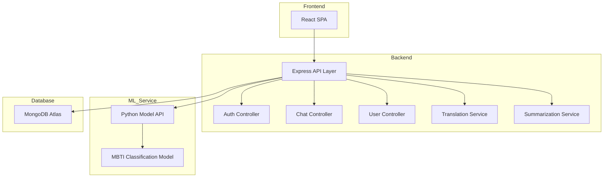

# 🧠 MBTI Cognitive Chatbot

An advanced AI-powered cognitive chatbot that integrates MBTI personality prediction, emotion-aware NLP, and contextual conversation management to deliver psychologically informed, personalized interactions.

This project demonstrates the integration of machine learning, scalable backend systems, and modular microservice architecture.

---

## 🚀 Project Overview

The system combines:

- **MBTI Personality Classification** (custom ML model)
- **Emotion & Tone Analysis** (HuggingFace, Gemini APIs)
- **Context-Aware Conversation Handling**
- **Secure REST API Architecture**
- **Containerized Microservice Deployment**

It is designed to simulate real-world AI integration within scalable backend infrastructure.

---

## 🏗️ System Architecture

The application follows a modular microservice architecture.

### High-Level Flow

```mermaid
graph TD
    A[User] -->|Interacts| B[React Client]
    B -->|REST API| C[Node.js/Express Server]
    C -->|Model Request| D[ML Model Service (Python)]
    C -->|Database Ops| E[MongoDB Atlas]
    C -->|External AI| F[HuggingFace / Gemini APIs]
    D -->|Prediction Response| C
    C -->|JSON Response| B
```

---

### Service Breakdown



---

## 🛠️ Tech Stack

### Frontend
- React.js (Single Page Application)

### Backend
- Node.js
- Express.js
- MongoDB Atlas
- JWT Authentication

### Machine Learning
- Python (Flask/FastAPI)
- Custom MBTI Classification Model
- HuggingFace API
- Gemini API

### DevOps
- Docker (multi-container setup)
- Environment-based configuration
- Modular service deployment

---

## ⚙️ Setup & Deployment

### 1️⃣ Clone the Repository

```bash
git clone https://github.com/your-username/mbti-chatbot.git
cd mbti-chatbot
```

---

### 2️⃣ Download the ML Model

Place the MBTI model file inside:

```
MLmodel/
```

(Refer to research documentation or contact authors for model access.)

---

### 3️⃣ Configure Environment Variables

Create a `.env` file inside `server/`:

```env
MONGO_URI=your_mongodb_connection_string
JWT_SECRET=your_secret_key
JWT_EXPIRES_IN=2h
HUGGINGFACE_API_KEY=your_key
GEMINI_API_KEY=your_key
```

⚠️ Never commit `.env` to version control.

---

## 🐳 Dockerized Deployment

From the project root:

### Client
```bash
docker build -t mbti-client ./client
docker run -d -p 3000:3000 mbti-client
```

### Server
```bash
docker build -t mbti-server ./server
docker run -d -p 5000:5000 mbti-server
```

### ML Model Service
```bash
docker build -t mbti-mlmodel ./MLmodel
docker run -d -p 5001:5001 mbti-mlmodel
```

---

## 🌐 Access Application

Once all services are running:

```
http://localhost:3000
```

---

## 🔐 Security Practices

- JWT-based authentication
- Environment variable isolation
- API key abstraction
- Secure MongoDB Atlas configuration
- Service isolation for ML inference

---

## 📈 Scalability Considerations

- Independent ML inference service
- Stateless backend design
- Horizontal scalability per service
- Containerized deployment model
- Externalized configuration management

---

## 🎓 Research Context

Developed as part of research in:

- Personality-driven conversational AI
- Emotion-aware NLP systems
- Cognitive interaction modeling

**Research Paper:**  
[Add Research Paper Link Here]

---

## 📌 Future Enhancements

- Kubernetes orchestration
- Persistent conversational memory
- Transformer-based fine-tuning
- CI/CD pipeline automation
- Cloud-native deployment

---

## 👥 Contributors

- Aryan Kumar
- Basavaraj Bhajantri
- Hariprasad BR
- I Suprabath Reddy

For research inquiries or collaboration, please contact the contributors.

---

## 📄 License

This project is intended for academic and research demonstration purposes.